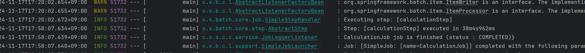
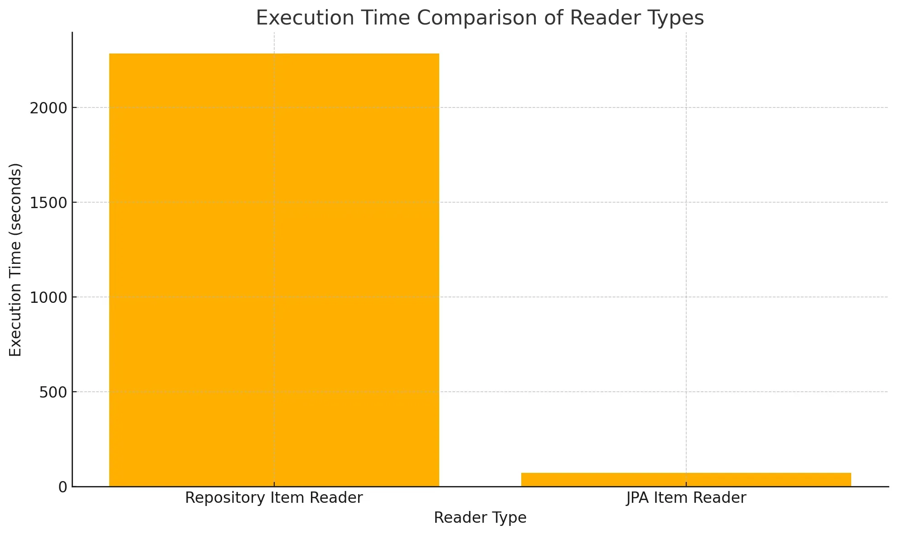
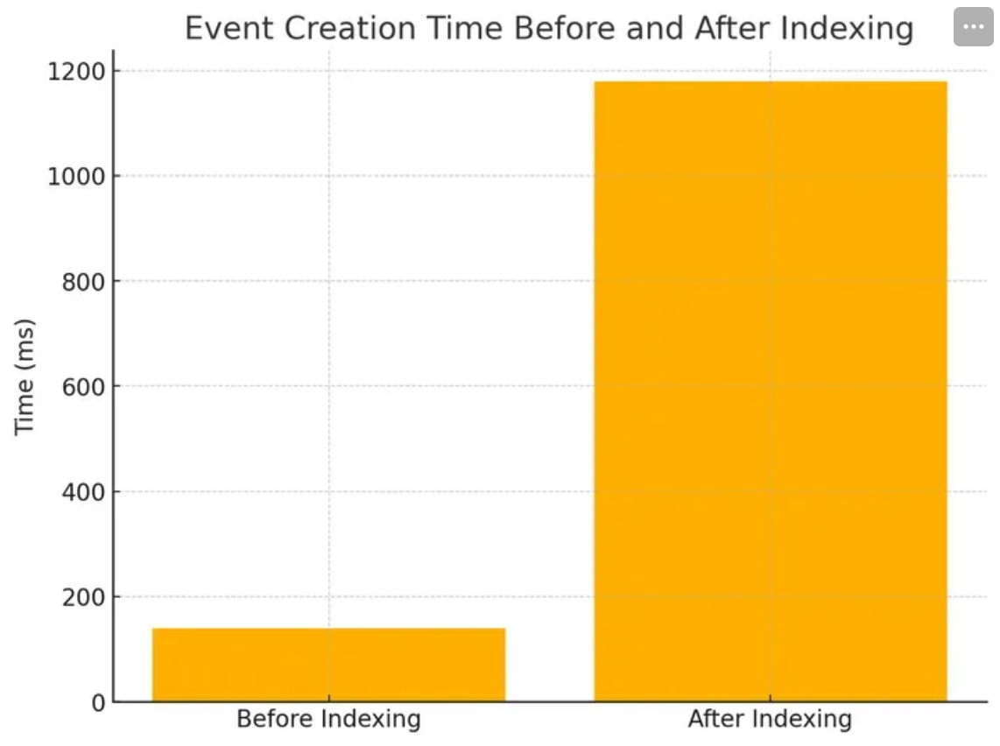
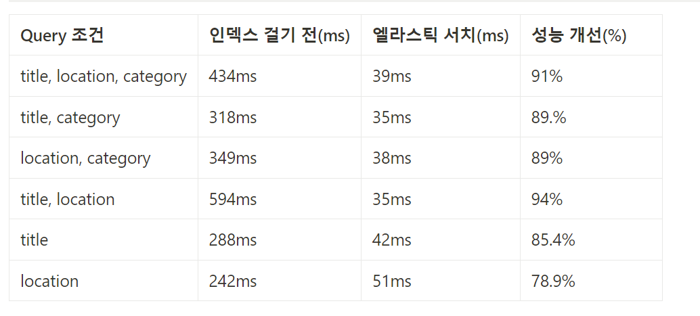
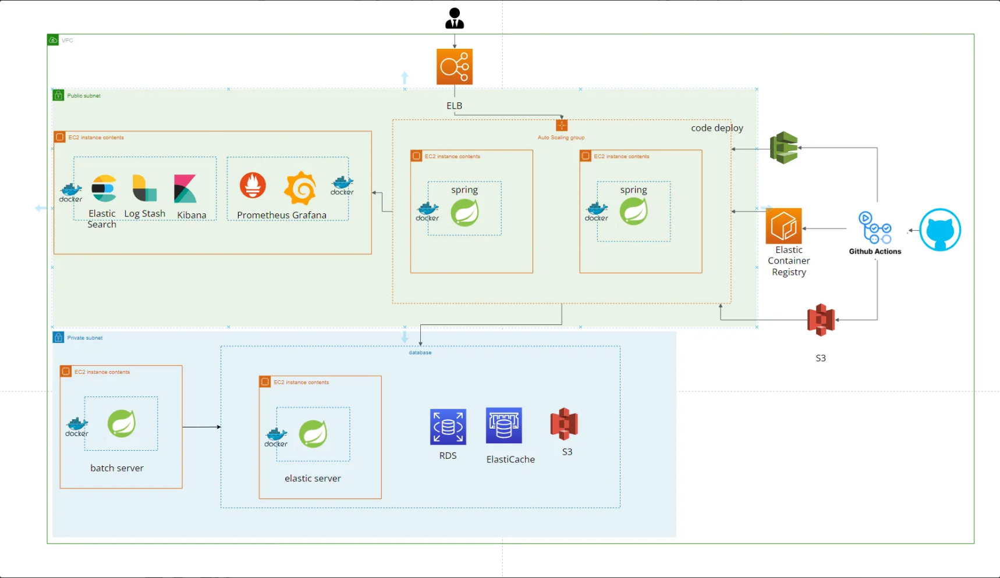
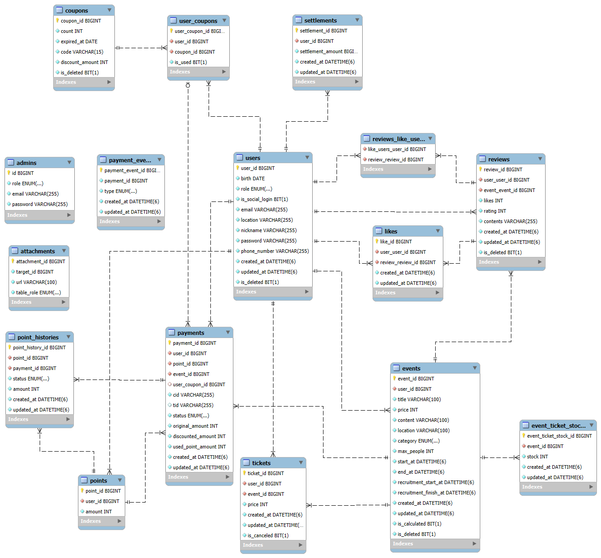

# 프로젝트명

소극장 (Spotlight Space)

---

## 목차

- [구성원](#구성원)
- [프로젝트 소개](#-프로젝트-소개)
- [프로젝트 핵심 목표](#프로젝트-핵심-목표)
- [프로젝트 주요 기능](#-프로젝트-주요-기능)
- [key summary](#%EF%B8%8F-key-summary)
- [트러블 슈팅](#%EF%B8%8F-트러블-슈팅)
- [인프라 및 아키텍처](#%EF%B8%8F-인프라-및-아키텍처)
- [ERD](#erd)
- [개발환경](#개발-환경)
- [기능 및 설명](#%EF%B8%8F-기능-및-설명)
- [사용 기술](#%EF%B8%8F-사용-기술)

---

## 구성원

| 이름  | 역할         | 주요 기여 내용                | GitHub 링크                            |
|-----|------------|-------------------------|--------------------------------------|
| 강태영 | Sub Leader | ElasticSearch, SSE, 인덱싱 | [프로필](https://github.com/kty0602)    |
| 김동규 | Member     | 결제 및 동시성 문제 해결          | [프로필](https://github.com/bronbe)     |
| 박한진 | Member     | 리뷰 및 좋아요 기능 구현          | [프로필](https://github.com/kanzinPark) |
| 조준호 | Leader     | CI/CD, 배치, 모니터링         | [프로필](https://github.com/juno0432)   |
| 최원  | Member     | 쿠폰 발급, 관리자 기능           | [프로필](https://github.com/Choi1999)   |

---

# 🎨 프로젝트 소개

잘 알려지지 않은 아티스트를 위한 **작은 공연/전시회 공간** 제공 서비스입니다.

- **목표**:  
  아티스트들이 팬들과 소통하고, 이벤트를 통해 수익을 창출하도록 지원합니다.
- **해결책**:  
  간단한 예약 시스템, 실시간 알림, 성능 최적화된 검색 기능을 제공합니다.

### 사용한 기술 스택

## 🌟 프로젝트 배경

### 문제점

- 대형 공연과 달리 **신예 아티스트**들은 홍보 및 지원이 부족하여 팬들과 교류하거나 무대를 설 수 있는 기회가 제한적입니다.

### 해결 방안

- **소극장 서비스**를 통해 작은 공연 및 전시회 공간을 제공하고 팬들과의 직접적인 소통을 지원합니다.
    - 📢 **팬과의 교류** 촉진
    - 💼 **수익 창출** 기회 제공

---

# 🚀 주요 기능

## 프로젝트 핵심 목표

### **테스트 코드 커버리지 유지**

- 테스트 코드 커버리지 **70%** 이상 달성

### ⚡ **성능 최적화**

- ElasticSearch 기반 이벤트 조회 속도 **88%** 개선

### 🛡️ **무중단 배포 및 보안 강화 서버 구축**

#### ⚙️ 안정적인 배포 및 운영 체계 구축

- **CI/CD** 적용:
    - GITHUB ACTIONS, DOCKER, AWS 활용
- **보안 강화**:
    - AWS WAF 기능으로 비정상적인 접근 및 해외 트래픽 차단

#### 📊 모니터링 시스템 구축

- **실시간 매트릭 모니터링**:
    - Prometheus, Grafana 활용

- **실시간 로깅 모니터링**:
    - ElasticSearch + Logstash + Kibana (ELK 스택) 사용
- 서버 상태 및 트래픽 확인을 통해 안정성 보장

---

# ⭐ 프로젝트 주요 기능

### 상세 내용

| **항목**              | **결과**              |
|---------------------|---------------------|
| 결제 동시성 제어           | Pessimistic Lock 적용 |
| 게시글 중복 등록 방지        | REDIS 기반 분산락 적용     |
| ElasticSearch 조회 성능 | 최대 **94% 개선**       |
| 배치 처리 최적화           | **96% 성능 향상**       |
| 테스트 코드 커버리지         | **70% 이상 유지**       |

---

### **동시성 제어**

- 결제 시스템의 동시성 제어를 위한 **Pessimistic Lock** 적용
    - [결제 시 재고에 대한 동시성 문제 해결](https://bronb.tistory.com/entry/%EA%B2%B0%EC%A0%9C-%EC%8B%9C-%EC%9E%AC%EA%B3%A0%EC%97%90-%EB%8C%80%ED%95%9C-%EB%8F%99%EC%8B%9C%EC%84%B1-%EB%AC%B8%EC%A0%9C-%ED%95%B4%EA%B2%B0)
- 게시글 중복 등록 방지를 위한 **REDIS 기반 분산 락** 적용
    - [동시성 제어(따닥 요청)](https://kty0602.tistory.com/79)

### **결제 시스템**

- 카카오페이 API를 이용해 결제 구현
- 동시성 제어로 신뢰도 높은 결제 시스템 구현
- 스프링 retry를 이용하여 재시도 가능한 예외의 경우에 재시도할 수 있도록 구현
- DB에 결제에 대한 이벤트를 저장하여 예상치 못한 에러에 대응

### **ElasticSearch를 통한 이벤트 조회**

- ElasticSearch를 활용하여 이벤트 조회 성능 최대 **94% 개선**
    - [엘라스틱 서치](https://kty0602.tistory.com/78)

### **스프링 배치를 활용한 정산 로직**

- 스프링 배치를 활용한 정산 로직 최적화
    - [스프링 배치를 활용한 정산 로직 최적화](https://juno0432.tistory.com/entry/%EA%B8%B0%EC%88%A0-%EA%B5%AC%ED%98%84%EC%8A%A4%ED%94%84%EB%A7%81-%EB%B0%B0%EC%B9%98%EB%A5%BC-%ED%99%9C%EC%9A%A9%ED%95%9C-%EC%A0%95%EC%82%B0-%EB%A1%9C%EC%A7%81-%EC%B5%9C%EC%A0%81%ED%99%94)

---

# 디테일

## 🔍 우리 팀의 고려 사항

<strong> Primitive 타입과 Reference 타입</strong>

- Primitive 타입과 Reference 타입의 큰 차이 중 하나는 **null 값 저장 가능 여부**임.
- **Primitive 타입**: null 값을 가질 수 없음.
- **Reference 타입**: null 값을 가질 수 있음.
- Null 값이 저장될 수 있는 경우는 Reference 타입을 사용하고, 그렇지 않은 경우는 Primitive 타입을 사용하여 **명확성**을 높이고 **불확실성**을 줄임.

<strong> Final 키워드</strong>

- `final` 키워드가 변수에 사용되면 **초기화 후 값을 변경할 수 없음**을 의미함
- 따라서 한번 초기화 후 값이 변경되면 안되는 경우에 `final` 키워드를 사용하여 불변성을 보장하고 코드의 안정성과 신뢰성을 높임
- 하지만 fianl 키워드가 불변성을 완벽하게 보장하지는 않으며 참조하고 있는 객체의 상태는 변경 가능함에 유의

<strong> Controller Layer - Service Layer DTO 분리</strong>

- 레이어드 아키텍처에서 각 레이어의 **의존 방향은 단방향**이어야 함.
- Controller Layer Dto(Request Dto)를 Service Layer에서 그대로 사용하게 된다면
  Service Layer에서 Controller Layer에 대한 **의존이 생기게 됨**
- 이로 인해 레이어 간 경계가 흐려지고 복잡도가 증가하므로 **각 레이어에 맞는 DTO를 사용하는 것이 권장됨**.

<strong> 캐싱: 성능 vs 정합성</strong>

- 프로젝트 주요 목적: 잘 알려지지 않은 아티스트들을 홍보할 기회를 제공.
- 사용자들에게 **정확한 데이터**를 전달하는 것이 중요.
- 따라서, 캐싱으로 성능을 높이는 것보다 **정합성을 유지하는 것이 우선**임.

<strong> 테스트 코드 작성 시 무엇을 테스트해야 하는가</strong>

- 각 기능이 **요구사항에 맞게 정상적으로 동작**하는지 검증.
- 예상치 못한 상황에서의 **적절한 예외 처리 및 메시지 검증**.
- 테스트 코드 작성 시 **Given-When-Then** 패턴을 활용:
    - **Given**: 테스트 환경 설정.
    - **When**: 특정 동작 실행.
    - **Then**: 결과 검증.

## ✔️ 기술적 의사결정

  
<strong>Jenkins vs Github Actions</strong>

### 배경

- CI / CD 도구인 Github Actions와 Jenkins 중 어느 것을 사용할지 고민함

### 요구사항

- 인적 리소스를 줄이기 위해 자동화된 테스트 툴 및 통합 툴이 필요했음.
- 빠른 배포 및 테스트가 필요했음.

### 선택지

#### 1. **Jenkins**

- **장점**
    - 다양한 플러그인 지원으로 다양한 환경에서 사용 가능
    - 복잡한 파이프라인을 구성할 수 있음
    - 대형 프로젝트에 유용함

- **단점**
    - 별도의 서버 설치가 필요하며 설치 및 유지보수에 대한 리소스가 요구됨
    - 복잡한 파이프라인 구성으로 인한 학습 곡선이 높음

#### 2. **GitHub Actions**

- **장점**
    - 간단한 설정만으로 ci/cd 파이프라인을 빠르게 구축할 수 있음
    - 다양한 언어와 무료 서버의 제공으로 별도의 서버 구축이 필요 없음

- **단점**
    - Jenkins에 비해 참고 자료가 미비함
    - 대형 프로젝트에는 적합하지 않음

### 의사결정 / 사유

- **Github Actions**를 사용하기로 결정하였습니다.
- **이유**:
    - 현재 프로젝트에서 확장성을 고려하여도 github actions에서 제공하는 ci/cd작업으로도 충분히 요구사항을 만족하기 때문.

#### jenkins가 제공하는 높은 확장성과 유연성도 장점이지만, 현재 프로젝트의 요구사항과 서버 관리 비용의 절감이 더 큰 이점으로 작용함.

  
<strong>블루그린 vs 카나리 vs 롤링배포</strong>

### 배경

- 무중단 배포를 하기 위해서 블루그린, 카나리, 롤링 배포 중 어떤 것을 선택할지 고민함

### 요구사항

- 사용자에게 영향을 주지 않으면서 배포를 진행해야 함
- 배포 시간을 최소화하고, 장애 발생 시 빠르게 롤백할 수 있어야 함
- 서비스의 안정성을 보장해야 함
- 서버의 자원을 효율적으로 사용해야 함

### 선택지

- **블루그린 배포**
- **카나리 배포**
- **롤링 배포**

## 의사결정 / 사유

- **블루그린 배포**를 사용하기로 결정하였습니다.
- **이유**:
    - 블루그린 배포는 새로운 버전의 서비스를 새로운 환경에 배포하고, 트래픽을 전환하는 방식으로 사용자에게 영향을 주지 않으면서 배포를 진행할 수 있습니다.
    - 또한, 롤백 시에도 이전 버전의 서비스를 사용할 수 있어 장애 발생 시 빠르게 대응할 수 있습니다.
    - 블루그린 배포는 서버의 자원을 효율적으로 사용할 수 있어, 서비스의 안정성을 보장할 수 있습니다.
    - 롤링 배포는 블루그린 배포보다 비용문제점을 개선하지만, 롤링 배포는 가용 트래픽에 손실이 있다.
    - 카나리 배포는 사용자 테스트의 기능을 갖고있으며 일부 사용자에게 배포를 한 후 배포 범위를 넓히는 방식이다, 트래픽 제어에 어려움을 겪을 수 있다.

  
<strong>모니터링</strong>

### 배경

- 분산된 환경에서 통합 로깅 및 모니터링 기술이 필요.

### 요구사항

- 서버의 상태와 트래픽을 실시간으로 확인할 수 있는 모니터링 시스템이 필요.
- 로그를 수집하고 분석할 수 있는 로깅 시스템이 필요.

### 선택지

- **Prometheus + Grafana**
- **ELK 스택 (ElasticSearch + Logstash + Kibana)**
- **AWS CloudWatch**
- **스프링 로거**

### 의사결정/사유

- **Prometheus + Grafana**를 사용하기로 결정하였습니다.
- **이유**:
    - Prometheus는 다양한 서버에서 쉽게 사용할 수 있으며, Grafana와 연동하여 시각화된 모니터링을 제공할 수 있습니다.
- **ELK 스택**을 사용하기로 결정하였습니다.
- **이유**:
    - ELK 스택은 로그 수집, 분석, 시각화를 한 번에 제공할 수 있어 통합된 모니터링 시스템을 구축할 수 있습니다.
- **AWS CloudWatch**는 AWS와 연동이 좋지만 GRAFANA같이 UI를 커스터마이징 하기 힘들다는 단점이 있습니다.

  
<strong>실시간 알림 SSE</strong>

### 배경

- 이벤트 참여를 위해 티켓을 구매한 참가자들에게 이벤트를 잊지 않도록 알림을 보내는 기능이 필요함
- 다양한 사용자에게 동시에 효율적으로 알림을 전송할 수 있는 방법을 선택해야 함

### 요구사항

- 이벤트 시작 하루 전, 1시간 전에 알림이 전송되어야 함
- 알림을 수신하는 동안 사용자가 연결 상태를 유지할 수 있어야 함
- 복잡한 설정 없이 클라이언트와 서버 간 통신을 쉽게 구현할 수 있어야 함

### 선택지

- **SSE** (Server-Sent Events)
- **웹 소켓** (WebSocket)

### 의사결정/사유

- **SSE**를 활용하여 알림 요청을 구현하기로 결정함
- 우선 해당 기능에 대해서 생각을 해봤을 때, 구매가 완료된 시점에서 서버가 지속적으로 확인하고 클라이언트로 전달되는 단방향 통신이므로 양방향 통신을 지원하는 웹소켓보다 **SSE**가 더 적합하다고 판단한 점과
- **SSE**가 HTTP 프로토콜에서 작동하며, 서버와 클라이언트가 기존의 HTTP 연결을 재활용한다는 점에서 리소스 소모가 적다는 이유가 **SSE**를 선택하게 된 주요한 이유입니다.

  
<strong>인덱스</strong>

### 배경

- DB 조회 성능을 개선하기 위해 인덱스를 최적화하고자 함.
- 조회 시 자주 사용되는 컬럼들을 기준으로 효율적인 인덱스 구성을 검토함.

### 요구사항

- 인덱스가 설정된 컬럼은 높은 카디널리티와 낮은 중복도를 가져야 하며, 선택도가 낮아 조회 시 결과 집합이 좁아지는 것이 좋음.

### 선택지

- **title(제목)**: 카디널리티가 높고 선택도가 낮아 인덱스 설정에 적합함.
- **category(종목)**: 활용도 면에서 높게 평가했으나 ART, MOVIE, MUSIC ... 6종류로 중복도가 높기 때문에 인덱스를 지정하기에는 아쉬움.
- **location(위치)**: 카디널리티가 중간 정도로 높으며 선택도와 중복도 면에서 효율적임.

### 의사결정/사유

- title과 category를 복합 인덱스로 설정하여 카디널리티와 선택도 기준으로 만족하면서도 조회 빈도가 높은 조건에 맞추도록 함.
- location과 category를 복합 인덱스로 설정해 자주 사용하는 조회 조건에 대해 효율을 높임.

  
<strong>엘라스틱 서치</strong>

### 배경

- 기존 DB에 인덱스를 적용하여 1차 성능 개선을 완료했으나, 점차 쌓여가는 데이터와 더 빠른 검색을 요구하는 비즈니스 요건을 만족하기 위해 Elastic Search 도입을 고려하였습니다.

### 요구사항

- 텍스트 기반의 빠르고 정확한 검색 기능을 제공하도록 Elastic Search를 도입해 성능을 추가로 개선해야 합니다.
- 인덱스에 의존할 때보다 더 많은 데이터를 고속으로 검색하며, 복잡한 조회 조건에서도 성능 저하 없이 일관된 응답 속도를 제공해야 합니다.

### 선택지

- **인덱스**: 기존 DB 인덱스만을 활용해 검색을 지속할 수 있지만, 대량의 텍스트 검색에서 성능 한계가 존재하고 고속 검색에 적합하지 않다고 판단되었습니다.
- **Elastic Search**: 대용량 텍스트 데이터와 복잡한 조회 조건에서 성능을 보장할 수 있으며, 추가적인 성능 최적화 기능을 제공합니다.

### 의사결정/사유

- **Elastic Search 도입 결정**: 대량의 텍스트 데이터 검색과 빠른 응답이 요구되는 상황에 맞춰 Elastic Search를 도입하여 검색 성능을 강화하기로 하였습니다.
- **기대 효과**: 기존 인덱스로는 부족했던 부분을 보완하고, 고속 검색을 가능하게 하여 사용자 경험을 크게 개선할 수 있었습니다.

  
<strong>연속 요청에 대한 동시성 제어</strong>

### 배경

- 이벤트 등록 요청이 거의 동시에 두 번 발생하는 상황에서 중복된 요청이 들어가 문제가 발생하였습니다.
- 두 요청이 동일한 작업을 수행하여 중복 처리될 가능성을 방지해야 합니다.

### 요구사항

- 중복된 요청이 동시에 처리되지 않도록 보장하는 동시성 제어가 필요합니다.

### 선택지

- **낙관적 락 (Optimistic Lock)**
- **비관적 락 (Pessimistic Lock)**
- **분산 락 (Distributed Lock)**

### 의사결정/사유

- **분산 락**을 사용하여 중복 요청 문제를 해결하기로 결정했습니다.

- **낙관적 락**
    - 낙관적 락 경우 재시도 로직이 필요한데, 직면한 문제는 같은 요청이 2번 들어가는 현상입니다. 따라서 해당 요청에 대해서 재시도 로직이 필요한가? 라는 의문점이 있었습니다.
    - 또한 낙관적 락은 충돌이 발생할 가능성이 낮을 때 유리하다는 점이 있어서 충돌이 자주 일어날 것 같은 중복 요청에 대해서는 낙관적 락은 사용하기에 적합하지 않다고 판단했습니다.

- **비관적 락**
    - 충돌이 자주 발생한다는 전제가 어느 정도 성립되지만, 다른 트랜잭션을 차단하기 때문에 성능 저하가 발생할 가능성이 있습니다.
    - 또한 충돌이 발생하면 대기 상태가 되어 트랜잭션 충돌이 잦아질 수 있습니다.

- **분산 락**
    - 한 번에 한 스레드만 실행할 수 있기 때문에 동시성 문제를 방지할 수 있었습니다.
    - 락을 점유하는 기간이 길어지면 그 만큼 성능 저하가 발생할 수 있습니다.
    - 락을 점유하는 구간을 짧게 가져 이에 대응합니다.

  
<strong>결제 시 동시성 제어</strong>

### 요구사항

- 결제 시 동시성 문제가 발생하지 않고 결제되어야 합니다.

### 선택지

- **Redisson**
- **Lettuce**
- **MySQL User-level Lock**
- **MySQL Pessimistic Lock**
- **Optimistic Lock**

### 의사결정 / 사유

- 로컬 환경에서 테스트를 진행하였습니다. 여러 선택지 중에서 결정을 위해 DB는 단일 DB를 이용한다고 가정하였으며 서버는 단일 서버 환경에서 테스트를 진행했지만 추후 트래픽이 늘어남에 따라 **Scale Out
  ** 상황을 고려했습니다.

- 테스트는 DB connection pool size 10, thread count 100, thread pool size 32로 두고 동시에 100개의 요청이 들어온다고 가정하였고.

- 아래처럼 여러 사항을 고려해 본 결과 **MySQL Pessimistic Lock**으로 결정하였습니다.

- **동시성 문제 발생 가능성**
    - Spotlight 서비스에서 동시성 문제 발생 가능성은 이벤트 주최자가 누군지에 따라 달라지게 됩니다.
    - 일반적인 경우에서는 동시성 문제가 발생할 가능성이 낮지만, 이벤트 주최자가 인기가 많은 경우 동시성 문제 발생 가능성이 올라가게 됩니다.
    - 동시성 문제가 발생하지 않는 경우에는 **MySQL Optimistic Lock**과 **MySQL Pessimistic Lock** 사이의 실행 속도 차이는 약 20ms로 차이가 크게 나지 않지만,
      동시성 문제가 발생한다면 성능의 차이가 많이 생기게 됩니다.

- **도메인 성격**
    - 결제는 재고에 따라 결제 가능 여부가 정해지기 때문에 가능한 요청이 들어온 순서대로 처리되는 것이 바람직합니다.
    - **MySQL Pessimistic Lock**은 CATS 알고리즘을 사용하여 트랜잭션에게 락을 할당합니다. 만약 대기 중인 트랜잭션의 가중치가 동일하다면 대기열에 먼저 들어온 트랜잭션이 락을 획득하게
      됩니다.
    - 반면, **Optimistic Lock**은 순서가 보장되지 않기 때문에 동시성 문제가 발생할 가능성이 높습니다.

  
<strong>분산 서버 환경에서의 세션 관리</strong>

### 배경

- 다중 서버 환경에서는 단일 서버 환경에서 발생하지 않았던 **세션 불일치** 문제가 발생하게 됩니다.

### 요구사항

- 다중 서버 환경에서 세션 불일치 문제가 발생하지 않아야 합니다.

### 선택지

1. **Sticky Session**  
   Sticky Session은 클라이언트의 요청이 항상 해당 클라이언트의 세션이 저장되어 있는 서버로 향하는 방식입니다.
    - **장점**: 세션 불일치 문제를 해결할 수 있습니다.
    - **단점**: 특정 서버에 트래픽이 집중될 수 있어, 서버 부하가 불균형하게 발생할 수 있습니다.

2. **Session Clustering**  
   Session Clustering은 특정 서버에 세션이 생성될 때 다른 서버로 세션을 공유하는 방식으로 세션 불일치 문제를 해결합니다.
    - **장점**: 세션을 여러 서버에서 공유하여 불일치 문제를 방지합니다.
    - **단점**:
        - **비효율적인 메모리 문제**: 같은 세션 데이터를 모든 서버가 가지고 있어 메모리를 비효율적으로 사용하게 됩니다.
        - **네트워크 트래픽 증가**: 세션을 공유하는 과정에서 네트워크 트래픽을 사용하게 됩니다.
        - **세션 불일치 가능성**: 세션을 전파하는 과정에서 시간차로 인해 세션 불일치 문제가 발생할 수 있습니다.

3. **Session Storage**  
   Session Storage는 세션 저장소를 외부로 분리하는 방법입니다. 세션 저장소로 인메모리 DB나 RDB를 사용하여 구현합니다.
    - **장점**: 세션 저장소를 중앙화하여 여러 서버에서 동일한 세션을 공유할 수 있습니다.
    - **단점**: 세션 저장소를 관리하는 시스템이 추가되어야 합니다.

### 의사결정 / 사유

- **Session Storage**를 이용하여 세션 불일치 문제를 해결하였습니다. 또한 세션 저장소로 **인메모리 DB**인 **레디스**를 사용하였습니다.
- **Session Clustering**은 세션을 다른 서버로 복제하여 공유하는 방식으로 세션 불일치 문제를 해결할 수 있지만, 다음과 같은 문제점이 존재합니다:
    - **비효율적인 메모리 사용**: 같은 세션 데이터를 모든 서버가 복제하여 메모리를 비효율적으로 사용하게 됩니다.
    - **네트워크 트래픽 문제**: 세션을 전파하는 과정에서 많은 네트워크 트래픽이 발생하게 됩니다.
    - **세션 불일치 가능성**: 세션을 전파하는 과정에서 시간차로 인해 세션 불일치가 발생할 수 있습니다.
- **세션**은 데이터의 특성상 **read/write** 작업이 빈번하게 발생하고, 데이터가 유실되어도 큰 문제가 발생하지 않기 때문에 **레디스**를 사용하였습니다.

  
<strong>쿠폰 발급 시스템 동시성 제어</strong>

### 배경

- 쿠폰 발급 시스템은 동시 사용자가 많을 경우 동시성 문제가 발생하여 동일한 쿠폰이 여러 번 발급될 수 있는 위험이 있습니다.  
  특히, 특정 수량이 제한된 고가의 쿠폰이나 특별한 이벤트의 경우, 이러한 동시성 문제는 서비스의 신뢰도와 안정성에 큰 영향을 미칩니다.
- 따라서 여러 사용자가 동시에 쿠폰을 발급 받을 때에도 데이터의 무결성을 유지할 수 있도록 적절한 락을 적용할 필요가 있습니다.

### 요구사항

- 동시 다발적인 쿠폰 발급 요청 시 중복 발급을 방지합니다.
- 고가의 쿠폰과 같이 제한된 수량의 쿠폰은 선착순 발급을 위해 안정성을 유지해야 합니다.
- 자주 발행되는 일반 쿠폰은 성능 저하 없이 안전하게 발급될 수 있어야 합니다.

### 선택지

1. **낙관적 락 적용 (Optimistic Locking)**  
   쿠폰 발급 시 `@Version` 필드를 사용하여 각 쿠폰의 버전 관리를 통해 동시성 문제를 해결하는 방법.
    - **장점**: 대부분의 경우 락을 획득하는 데 있어 성능 저하가 없고, 일반적인 쿠폰 발급에 적합.
    - **단점**: 동시성 충돌이 자주 발생하면 반복적인 재시도 로직이 필요할 수 있음.

2. **비관적 락 적용 (Pessimistic Locking)**  
   쿠폰 조회 시 `PESSIMISTIC_WRITE` 락을 사용하여 다른 사용자가 접근하지 못하도록 락을 거는 방법.
    - **장점**: 고가의 쿠폰이나 중요한 이벤트에 대해 확실히 한 번만 발급되도록 보장 가능.
    - **단점**: 락을 걸면서 성능 저하가 발생할 수 있으며, 특히 트래픽이 많을 때 문제 발생 가능.

3. **Redis를 이용한 분산 락 적용**  
   Redis의 분산 락 기능을 사용하여 동시 요청을 제어하는 방법.
    - **장점**: 다중 서버 환경에서도 동시성 문제를 해결할 수 있음.
    - **단점**: Redis 설정 및 관리 비용이 발생하며, 락 해제에 실패할 경우 문제가 생길 수 있음.

### 의사결정 / 사유

- **낙관적 락**과 **비관적 락**을 모두 구현하여 상황에 따라 선택적으로 사용할 수 있도록 하였습니다.

- **낙관적 락**: 일반 쿠폰처럼 자주 발행되는 쿠폰에 대해 적용하여 성능 저하를 최소화 하였습니다.
- **비관적 락**: 고가의 쿠폰이나 한정된 수량을 가진 특별 쿠폰에 대해 데이터 무결성을 보장하기 위해 적용하였습니다.

- 초기 요구사항에서는 **Redis**와 같은 분산 락 솔루션까지는 필요하지 않았고, 시스템의 복잡성을 낮추기 위해 **Spring Data JPA**에서 제공하는 락을 우선 사용하기로 결정했습니다.
- 나중에 다중 서버 환경에서의 확장이나 쿠폰 발급 성능 문제가 발생할 경우 Redis 락을 도입할 가능성도 열어두었습니다.

---

# 🗝️ KEY SUMMARY

## 핵심 성능 개선: 스프링 배치를 활용한 정산 로직

---

### 한줄 요약

- **BATCH 재시작 로직** 도입으로 실패 시 재시작 구현
- **Reader 개선** 및 **Bulk Insert 활용**으로 쿼리 수와 DB 오버헤드를 감소, 처리 시간을 **96% 개선**

---

### 도입 배경

- 기존 스케줄러는 **오류 발생 시 재시작 로직**이 부족하여 유실 위험 존재
- N+1 문제와 개별 Insert로 인해 **DB 부하** 증가

---

### 개선 결과

- **JPA Item Reader** 도입으로 기존 Repository Item Reader 대비 성능을 **96% 개선**
- N+1 문제를 해결하고, 개별 Insert를 Bulk Insert로 전환하여 **DB 로직 최적화**
- 개선 전: **Repository Item Reader** 사용 시 과도한 쿼리 호출  
  
- 개선 후: **JPA Item Reader** 사용으로 쿼리 호출 최적화  
  

---

### 📈 개선 성능 차트

- 아래 차트는 개선 전후의 처리 시간을 비교한 결과를 시각화한 것입니다:  
  

---

## 🔧 핵심 트러블 슈팅

### 엘라스틱 서치를 활용한 성능 개선

---

### 한줄 요약

- **인덱스 제거** 및 **읽기 요청을 ElasticSearch로 분리**하여 조회 성능을 **88% 개선**

---

### 도입 배경

- 성능 최적화를 위해 **인덱싱을 적용**했으나, **읽기 성능은 개선**되었지만 **쓰기 성능이 악화**됨
- 이를 해결하기 위해 **인덱스 제거**와 **읽기 요청을 ElasticSearch로 분리**하여 성능을 최적화

---

### 개선 과정 및 결과

- **인덱싱 전후 성능 차이**  
  

- **개선 후 결과**  
  

- ElasticSearch를 통해 조회 성능을 **88% 개선**

---

### 주요 성과

- 읽기 요청과 쓰기 성능 간의 균형을 맞추며, 성능 최적화에 성공
- 인덱스 관리 전략 변경으로 시스템 부하 감소

--- 

# 🛠️ 트러블 슈팅

## 강태영

#### ✅ 올바른 단위 테스트 작성  : <a href="https://kty0602.tistory.com/80" style="color: black; text-decoration: none; ">🔗 Spy 어노테이션을 사용하여 단일 책임을 갖는 단위 테스트 작성</a>

#### 📉 인덱스 도입으로 인한 쓰기 성능 저하 문제 해결 : <a href="https://kty0602.tistory.com/81 " style="color: black; text-decoration: none; ">🔗 인덱스 도입 후 10배 증가한 쓰기 성능 문제를 ElasticSearch 도입으로 개선</a>

---

## 김동규

#### 🌐 다중 서버 환경에서의 세션 관리 : <a href="https://bronb.tistory.com/entry/%EB%8B%A4%EC%A4%91-%EC%84%9C%EB%B2%84-%ED%99%98%EA%B2%BD%EC%97%90%EC%84%9C%EC%9D%98-%EC%84%B8%EC%85%98-%EA%B4%80%EB%A6%AC"  style="color: black; text-decoration: none; "> 🔗 다중 서버 환경에서 발생하는 세션 불일치 문제를 Session Storage로 해결</a>

#### 🔄 Transactional 얼마나 알고 사용하시나요? : <a href="https://bronb.tistory.com/entry/Transactional-%EC%96%BC%EB%A7%88%EB%82%98-%EC%95%8C%EA%B3%A0-%EC%82%AC%EC%9A%A9%ED%95%98%EC%8B%9C%EB%82%98%EC%9A%94" style="color: black; text-decoration: none; "> 🔗 멀티 쓰레드 문제 해결 및 트랜잭션의 올바른 사용 방법 고찰</a>

---

## 조준호

#### 🩺 ELB 헬스체크 문제 : <a href="https://juno0432.tistory.com/entry/%ED%8A%B8%EB%9F%AC%EB%B8%94-%EC%8A%88%ED%8C%85-ELB-%ED%97%AC%EC%8A%A4%EC%B2%B4%ED%81%AC-%EB%AC%B8%EC%A0%9C" style="color: black; text-decoration: none; "> 🔗 무중단 배포를 위해 ELB 헬스체크 문제를 해결</a>

#### 🛡️ 악의적인 트래픽을 받지 않으려면 : <a href="https://juno0432.tistory.com/entry/%ED%8A%B8%EB%9F%AC%EB%B8%94-%EC%8A%88%ED%8C%85-aws-waf%EB%A1%9C-%EC%99%B8%EB%B6%80-%EC%A0%91%EA%B7%BC-%EC%B0%A8%EB%8B%A8%ED%95%98%EA%B8%B0" style="color: black; text-decoration: none; "> 🔗 모든 포트 허용으로 인한 악의적인 트래픽 차단을 위한 다양한 방법 도입</a>

#### 📧 이메일 발송 비동기로 전환하기 : <a href="https://juno0432.tistory.com/entry/%ED%8A%B8%EB%9F%AC%EB%B8%94-%EC%8A%88%ED%8C%85-%EC%9D%B4%EB%A9%94%EC%9D%BC-%EB%B0%9C%EC%86%A1%EC%9D%84-%EB%B9%84%EB%8F%99%EA%B8%B0%EC%A0%81%EC%9C%BC%EB%A1%9C-%EC%A0%84%ED%99%98%ED%95%9C-%EC%9D%B4%EC%9C%A0" style="color: black; text-decoration: none; "> 🔗 이메일 발송을 비동기로 전환하여 시스템 성능 최적화</a>

---

# 🏗️ 인프라 및 아키텍처

## 인프라 구조

---

### 주요 구성 요소

| **분류**     | **상세 내용**                                       |
|------------|-------------------------------------------------|
| **AWS**    | EC2, RDS, S3, CodeDeploy, ALB, VPC, ElastiCache |
| **CI/CD**  | GitHub Actions                                  |
| **배포**     | Docker                                          |
| **로그 수집**  | ElasticSearch, Logstash, Kibana                 |
| **모니터링**   | Prometheus, Grafana                             |
| **로드 밸런서** | AWS ALB                                         |
| **보안**     | AWS WAF                                         |

---

### 특이 사항

- **확장성**: AWS 기반으로 구성하여 서비스의 확장성과 안정성을 확보
- **CI/CD 자동화**: GitHub Actions와 Docker를 활용한 무중단 배포
- **모니터링**: Prometheus와 Grafana로 실시간 매트릭 관리
- **보안 강화**: AWS WAF를 활용해 비정상적인 접근 및 악의적 트래픽 차단

---

## ERD

---

## 개발 환경

| 분류             | 상세                          |
|----------------|-----------------------------|
| **IDE**        | IntelliJ                    |
| **Language**   | Java 17                     |
| **Framework**  | Spring Boot 3.3.4           |
| **Repository** | MYSQL, REDIS, H2(Test)      |
| **Build Tool** | Gradle 8.8                  |
| **Infra**      | EC2, Docker, Github Actions |

---

## 상세 개발 환경

- **Spring Framework**
    - Spring WebMVC
    - Spring Validation
    - Spring Security
    - Spring Data JPA
    - Spring Data Redis
    - Spring Batch 5.1.2
    - Spring Boot Actuator

- **Authentication & Authorization**
    - JWT (jjwt 0.12.6)
    - Bcrypt

- **Database & Query**
    - MySQL, H2 (Test)
    - QueryDSL 5.0.0

- **Integration & APIs**
    - AWS S3 (Spring Cloud AWS 2.2.6.RELEASE)
    - Spring Boot Starter Mail
    - Slack API (Bolt 1.44.1)
    - ElasticSearch

- **Utilities**
    - Lombok
    - Spring Retry

- **Testing**
    - JUnit 5
    - Spring Security Test

- **Logging & Monitoring**
    - Logstash Logback Encoder 7.3
    - Prometheus (Micrometer Registry)

- **Frontend Rendering**
    - Thymeleaf

- **Reactive Programming**
    - Spring WebFlux

- **Documentation**
    - Swagger 2.6.0

---

# ✍️ 기능 및 설명

회원 - 조준호

<ul>
<li>담당자: 조준호</li>
<li>회원 관리 로직을 수행하며, 로그인부터 OAuth2 기반 로그인, 비밀번호 찾기 시 이메일 발송까지 다양한 기능을 제공합니다.</li>
<li>기능:
  <ul>
    <li>회원 CRUD</li>
    <li>회원탈퇴</li>
    <li>회원조회</li>
    <li>비밀번호 변경</li>
    <li>쿠폰 조회</li>
    <li>정산 조회</li>
    <li>메일 발송 및 확인</li>
    <li>리프레시 토큰 재발급</li>
    <li>카카오 및 네이버 로그인 연동</li>
  </ul>
</li>
</ul>

결제 - 김동규

<ul>
<li>담당자: 김동규</li>
<li>카카오 페이 API를 연동하여 결제를 구축하였습니다.</li>
<li>기능:
  <ul>
    <li>결제하기</li>
    <li>결제취소</li>
    <li>결제내역</li>
  </ul>
</li>
<li>결제 시 발생할 수 있는 동시성 문제를 해결하였습니다.</li>
</ul>

정산 - 김동규, 조준호

<ul>
<li>담당자: 김동규, 조준호</li>
<li>스프링 배치와 스케쥴링을 사용하여 매달 1일 유저에게 포인트가 정산됩니다.</li>
<li>기능:
  <ul>
    <li>정산 처리</li>
  </ul>
</li>
</ul>

이벤트 - 강태영

<ul>
<li>담당자: 강태영</li>
<li>게시글과 관련된 기능입니다.</li>
<li>기능:
  <ul>
    <li>제목, 내용, 시작 시간, 종료 시간, 모집 기간, 제한 인원, 가격 등의 데이터를 요구합니다.</li>
    <li>이벤트 CRUD</li>
  </ul>
</li>
</ul>

첨부파일 - 강태영

<ul>
<li>담당자: 강태영</li>
<li>이벤트, 유저, 리뷰에서 사용할 수 있도록 테이블 별 구분 및 아이디 별 관리가 가능하도록 설계된 첨부파일 전용 관리 기능입니다.</li>
<li>기능:
  <ul>
    <li>첨부파일 CRUD</li>
  </ul>
</li>
</ul>

포인트 - 강태영

<ul>
<li>담당자: 강태영</li>
<li>티켓 구매 및 포인트 정산이 가능한 포인트 관리 기능입니다.</li>
<li>기능:
  <ul>
    <li>포인트 조회</li>
    <li>포인트 이력 조회</li>
    <li>포인트 충전</li>
  </ul>
</li>
</ul>

리뷰 - 박한진

<ul>
<li>담당자: 박한진</li>
<li>리뷰 서비스 로직을 수행하며, 이벤트 예매 시 공연 종료 시간이 지난 후 리뷰 CRUD 및 좋아요 기능을 제공합니다.</li>
<li>기능:
  <ul>
    <li>리뷰 작성</li>
    <li>리뷰 조회</li>
    <li>리뷰 수정</li>
    <li>리뷰 삭제</li>
    <li>좋아요</li>
  </ul>
</li>
</ul>

쿠폰 - 최원

<ul>
<li>담당자: 최원</li>
<li>쿠폰 발행과 관련된 작업을 수행하며, 동시성 처리를 통해 경합 문제를 해결했습니다.</li>
<li>기능:
  <ul>
    <li>쿠폰 생성</li>
    <li>쿠폰 조회</li>
    <li>쿠폰 발급</li>
    <li>쿠폰 삭제</li>
  </ul>
</li>
</ul>

관리자 - 최원

<ul>
<li>담당자: 최원</li>
<li>관리자 테이블을 따로 만들어 관리자가 유저를 확인할 수 있습니다.</li>
<li>기능:
  <ul>
    <li>리뷰 리스트 조회</li>
    <li>이벤트 리스트 조회</li>
    <li>유저 리스트 조회</li>
    <li>유저 권한 변경</li>
    <li>유저 삭제</li>
    <li>이벤트 삭제</li>
    <li>리뷰 삭제</li>
  </ul>
</li>
</ul>

---

# ✍️ 사용 기술

REDIS

<ul>
<li><strong>도입 이유 및 근거</strong>:
  <ul>
    <li>빠른 데이터 처리속도</li>
    <li>TTL 지원: 만료 시간을 설정해 데이터 자동 삭제 가능</li>
    <li>다양한 데이터 구조 지원</li>
    <li>DB 부하 감소</li>
  </ul>
</li>
<li><strong>도입 목적</strong>:
  <ul>
    <li>이메일 인증: 인증번호 임시 저장소로 사용</li>
    <li>리프레시 토큰 관리: 빠른 조회와 유효기간 관리</li>
    <li>유저 로그아웃: 토큰 블랙리스트 관리</li>
    <li>Session Storage: 분산 환경에서 세션 불일치 해결</li>
  </ul>
</li>
<li><strong>기대 효과</strong>:
  <ul>
    <li>응답 속도 향상</li>
    <li>DB 부하 감소</li>
    <li>효율적인 토큰 관리</li>
  </ul>
</li>
</ul>

AWS

<ul>
<li><strong>도입 이유 및 근거</strong>:
  <ul>
    <li>다양한 서비스 지원</li>
    <li>확장성과 유연성</li>
    <li>다양한 보안 및 인증 지원</li>
    <li>비용 효율성</li>
  </ul>
</li>
<li><strong>도입 목적</strong>:
  <ul>
    <li>빠르고 유연한 웹 서비스 구축 및 배포</li>
  </ul>
</li>
<li><strong>기대 효과</strong>:
  <ul>
    <li>유연한 확장성</li>
    <li>운영 간소화</li>
    <li>비용 절감</li>
  </ul>
</li>
<li><strong>사용 기술</strong>:
  <ul>
    <li>EC2: 서버 운영</li>
    <li>RDS: 안정적인 데이터베이스 관리</li>
    <li>S3: 이미지 업로드 및 배포 관련 파일 관리</li>
    <li>ECR: Docker 이미지 저장 및 관리</li>
    <li>ElastiCache: 완전관리형 인메모리 DB</li>
    <li>로드밸런서: 대용량 트래픽 부하 분산</li>
    <li>CodeDeploy: 자동 배포 활성화</li>
  </ul>
</li>
</ul>

로그수집 (ELK)

<ul>
<li><strong>도입 이유 및 근거</strong>:
  <ul>
    <li>중앙화된 로그 관리</li>
    <li>실시간 로그 분석</li>
  </ul>
</li>
<li><strong>용도</strong>:
  <ul>
    <li>로그 수집 및 분석</li>
    <li>로그 시각화</li>
  </ul>
</li>
<li><strong>작동 원리</strong>:
  <ol>
    <li>Spring Boot → logstash가 로그 수집</li>
    <li>logstash → Elasticsearch로 데이터 저장 및 색인화</li>
    <li>Elasticsearch → Kibana로 데이터 시각화</li>
  </ol>
</li>
</ul>

모니터링 (프로메테우스 + 그라파나)

<ul>
<li><strong>도입 이유 및 근거</strong>:
  <ul>
    <li>서비스 상태 확인 및 사전 대응</li>
  </ul>
</li>
<li><strong>용도</strong>:
  <ul>
    <li>실시간 매트릭 수집 및 저장</li>
    <li>데이터 시각화</li>
  </ul>
</li>
<li><strong>기대 효과</strong>:
  <ul>
    <li>운영 효율성 향상</li>
    <li>실시간 문제 감지</li>
    <li>관리 편의성</li>
  </ul>
</li>
<li><strong>작동 원리</strong>:
  <ol>
    <li>Spring Boot Actuator → Prometheus가 메트릭 수집</li>
    <li>Prometheus → 데이터 저장 및 관리</li>
    <li>Prometheus → Grafana로 데이터 시각화</li>
  </ol>
</li>
</ul>

SPRING BATCH

<ul>
<li><strong>도입 이유 및 근거</strong>:
  <ul>
    <li>대량 데이터의 정기적 안정적 처리 필요</li>
  </ul>
</li>
<li><strong>도입 목적</strong>:
  <ul>
    <li>정산 처리 안정성 확보</li>
    <li>스케줄링과 결합해 배치 수행</li>
    <li>재시작과 스킵 기능을 통한 안정적 데이터 처리</li>
  </ul>
</li>
<li><strong>기대 효과</strong>:
  <ul>
    <li>실패 시 재시작 가능</li>
    <li>모듈화로 유지보수성 향상</li>
  </ul>
</li>
</ul>

GitHub Actions

<ul>
<li><strong>도입 이유 및 근거</strong>:
  <ul>
    <li>YAML 기반으로 간편하게 CI/CD 파이프라인 구축</li>
    <li>별도 서버 설치 없이 이용 가능</li>
    <li>통합된 CI/CD 파이프라인 제공</li>
  </ul>
</li>
<li><strong>도입 목적</strong>:
  <ul>
    <li>자동화된 배포 프로세스 구축</li>
    <li>팀 협업 활성화</li>
  </ul>
</li>
<li><strong>기대 효과</strong>:
  <ul>
    <li>개발 효율성 향상</li>
    <li>운영 간소화</li>
  </ul>
</li>
</ul>

ElasticSearch

<ul>
<li><strong>도입 이유 및 근거</strong>:
  <ul>
    <li>빠른 검색 성능</li>
    <li>대용량 데이터 처리</li>
  </ul>
</li>
<li><strong>도입 목적</strong>:
  <ul>
    <li>데이터 검색 속도 개선</li>
    <li>실시간 분석</li>
  </ul>
</li>
<li><strong>기대 효과</strong>:
  <ul>
    <li>검색 성능 향상</li>
    <li>운영 효율성 증가</li>
  </ul>
</li>
</ul>

DOCKER

<ul>
<li><strong>도입 이유 및 근거</strong>:
  <ul>
    <li>효율적인 리소스 활용</li>
    <li>자동화된 배포 가능</li>
  </ul>
</li>
<li><strong>도입 목적</strong>:
  <ul>
    <li>EC2 서버 배포</li>
    <li>모니터링 시스템 구축</li>
  </ul>
</li>
<li><strong>기대 효과</strong>:
  <ul>
    <li>배포 효율성 증가</li>
    <li>운영 관리 간소화</li>
    <li>확장성 확보</li>
  </ul>
</li>
</ul>

SSE

<ul>
<li><strong>도입 이유 및 근거</strong>:
  <ul>
    <li>단방향 통신 필요성</li>
  </ul>
</li>
<li><strong>도입 목적</strong>:
  <ul>
    <li>효율적인 알람 전송</li>
  </ul>
</li>
<li><strong>기대 효과</strong>:
  <ul>
    <li>네트워크 및 서버 자원 절약</li>
    <li>실시간 알림 보장</li>
  </ul>
</li>
</ul>

카카오페이 API

<ul>
<li><strong>도입 이유 및 근거</strong>:
  <ul>
    <li>결제 기능 지원</li>
    <li>국내 사용자 친화성</li>
    <li>다양한 결제 옵션 제공</li>
  </ul>
</li>
<li><strong>도입 목적</strong>:
  <ul>
    <li>간편 결제 제공</li>
    <li>결제 안정성 및 신뢰성 확보</li>
  </ul>
</li>
<li><strong>기대 효과</strong>:
  <ul>
    <li>사용자 편의성 향상</li>
    <li>결제 프로세스 효율화</li>
  </ul>
</li>
</ul>

SMTP

<ul>
<li><strong>도입 이유 및 근거</strong>:
  <ul>
    <li>유저 인증 시 이메일 인증 필요</li>
  </ul>
</li>
<li><strong>도입 목적</strong>:
  <ul>
    <li>신뢰성 높은 이메일 전송</li>
  </ul>
</li>
<li><strong>기대 효과</strong>:
  <ul>
    <li>보안 향상</li>
    <li>자동화된 프로세스</li>
  </ul>
</li>
</ul>

